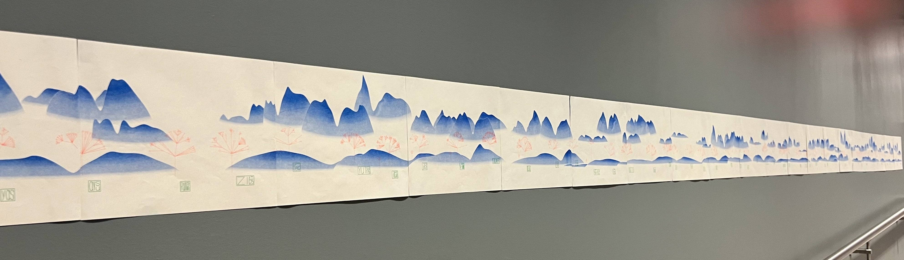

# {Mountains, Trees}\*

**Pan forever. Find the tree you planted.**

[](https://landscape.bairui.dev/)
[](https://bairui.dev/name2tree)


[\{Mountains, Trees, Names\}\*](https://landscape.bairui.dev/) is a procedurally generated infinite landscape collectively created from the trees of [Find the Tree in Your Name](https://tree.bairui.dev/) participants at [ITP Spring 2025](https://itp.nyu.edu/shows/spring2025/projects/#11830-find-the-tree-in-your-name). Zoom and pan across layered mountains; each tree is a name turned into form, signed with an [APack](https://apack.bairui.dev/) stamp.

Inspired by Lingdong Huang's [\{Shan, Shui\}\*](https://github.com/LingDong-/shan-shui-inf) and the Chinese painting [A Thousand Li of Rivers and Mountains](https://en.wikipedia.org/wiki/Wang_Ximeng), the project explores infinite composition, collective authorship, and the feeling that **those who plant the trees become part of the landscape itself**.

> *The creators are embedded in the creation.*

[**Try it live →**](https://landscape.bairui.dev/) · [**Plant your tree →**](https://tree.bairui.dev/) · [**Project story →**](https://bairui.dev/mountains-trees-names-inf)

## What it does

1. **Generate** — Midpoint-displacement mountains unfold in two depth layers with radial gradients in blue, green, and gold.
2. **Plant** — Every tree in `names.json` is placed along the ridgeline, drawn by [Charming.js](https://charmingjs.org/) from the same name-to-tree algorithm as [Name2Tree](https://tree.bairui.dev/).
3. **Sign** — APack stamps mark authorship on each tree, visible marks of who grew what.
4. **Explore** — D3 zoom and pan reveal an endless scroll; new terrain loads as you move.
5. **Present** — At ITP Winter Show 2025, [Chloe](https://www.instagram.com/qiyun_chloe/) and I printed 60 pages on a [Riso](https://us.riso.com/) printer and tiled them on the wall, making the digital forest tangible.

## Why it exists

This project grew out of [Find Trees in Names: What if We are Trees?](https://bairui.dev/name2tree). After collecting hundreds of trees from the ITP Spring Show, I wanted to see them not as a grid or a cloud, but as a **forest in a landscape** — the way names hide inside language, the way cypress hides inside `柏`.

I was first drawn to Lingdong Huang's [\{Shan, Shui\}\*](https://shan-shui-inf.lingdong.works/) for its overall composition — mountains and rivers connected across a long-distance view, perfect for zooming and panning. A few years later, a musical theatre performance called [A Tapestry of a Legendary Land](https://en.wikipedia.org/wiki/Wang_Ximeng) about Wang Ximeng painting [A Thousand Li of Rivers and Mountains](https://en.wikipedia.org/wiki/Wang_Ximeng) stayed with me. I kept wanting to work with those yellow, blue, and green colors.

The landscape itself evolved in stages:

**Thanksgiving 2024 — triangles.** I wrote a `triangle(x)` function that places a triangle at each position using uniform and noise randomness, then repeats with a small offset until the range `[startX, endX]` fills up.


**Half a year later — color.** In Daniel Shiffman's *The Nature of Code* at ITP, I moved the scene to SVG and added `radialGradient` fills, borrowing the palette from Wang Ximeng's painting.


**Thanksgiving 2025 — trees and mountains.** I planted every participant tree into the scene with APack stamps and swapped triangles for midpoint-displacement mountains — more like shanshui, still infinite. The stamps made authorship visible: every person who grew a tree left a mark in the landscape.


**ITP Winter Show 2025 — Riso prints.** [Chloe](https://www.instagram.com/qiyun_chloe/) had just taken Print and Code and wanted to experiment with a [Riso](https://us.riso.com/) printer — so we printed the landscape as 60 pages of A4 paper, from 10pm to 6am. With only a few ink colors available, we picked blue for mountains, orange for trees, and green for stamps. Each page needed four copies and three passes through the printer. We tiled the pages on the wall at ITP Winter Show 2025, making the digital forest tangible.



## How it works

```
names.json (ITP Spring Show participants)
      │
      ▼
┌─────────────────────────────────────┐
│  generateMountains()                │  midpoint displacement + Perlin noise
│  far layer + close ridgeline        │  radialGradient fills (theme.js)
└─────────────────────────────────────┘
      │
      ▼
┌─────────────────────────────────────┐
│  generateTrees()                    │  place each name on the ridgeline
│  tree.js → Charming.js SVG          │  APack stamp per tree
└─────────────────────────────────────┘
      │
      ▼
┌─────────────────────────────────────┐
│  D3 zoom + pan                      │  lazy-load [startX, endX] as you scroll
│  d3.curveBundle mountain paths      │  ?show=true for fullscreen kiosk mode
└─────────────────────────────────────┘
```

**Mountains** (`render.js`) — seeded noise drives height, width, and gradient stops; recursive subdivision adds natural roughness.

**Trees** (`tree.js`) — ASCII/Unicode digits from each name drive a breadth-first tree; degenerate runs become roses, same as Name2Tree.

**Interaction** — `d3.zoom` scales and translates the scene; `maybeLoad()` extends the visible range so the landscape feels infinite.

## Tech stack

| Layer | Tools |
|-------|-------|
| Rendering | [D3.js](https://d3js.org/) — zoom, paths, data join |
| Trees | [Charming.js](https://charmingjs.org/), [apackjs](https://apack.bairui.dev/) |
| Noise | Custom Perlin (`noise.js`), `gl-matrix` |
| Gradients | SVG `radialGradient` (`gradient.js`) |
| Build | Vite |

## Getting started

**Requirements:** Node.js 18+, pnpm

```bash
git clone https://github.com/pearmini/infinite-landscape.git
cd infinite-landscape
pnpm install
pnpm dev
```

Open [http://localhost:5173](http://localhost:5173). Scroll and zoom to explore.

```bash
pnpm build     # production build
pnpm preview   # preview production build
```

Append `?show=true` for fullscreen kiosk mode (hides footer links, adds a fullscreen button).

## Project structure

```
infinite-landscape/
├── render.js       # Mountains, trees, zoom, lazy loading
├── tree.js         # Name → tree SVG (Charming.js)
├── gradient.js     # Radial gradient helpers
├── noise.js        # Perlin noise for terrain
├── theme.js        # Sky and mountain palette
├── names.json      # ITP Spring Show participant names
├── main.js         # Mount, resize, kiosk mode
└── index.html
```

## Related work

- [landscape.bairui.dev](https://landscape.bairui.dev/) — live demo
- [bairui.dev/mountains-trees-names-inf](https://bairui.dev/mountains-trees-names-inf) — full story, Riso process, and reflection
- [tree.bairui.dev](https://tree.bairui.dev/) — grow your own tree
- [tree.bairui.dev/forest](https://tree.bairui.dev/forest) — community forest gallery
- [bio.bairui.dev](https://bio.bairui.dev/) — [BioGlyph](https://bairui.dev/bio-glyph), one-line faces from the same ITP lineage
- [{Shan, Shui}\*](https://github.com/LingDong-/shan-shui-inf) — original infinite shanshui inspiration

## Thanks

Huge thanks to everyone who planted a tree at ITP Spring Show 2025 — come find yours in the landscape. And to [Chloe](https://www.instagram.com/qiyun_chloe/) for the all-night Riso marathon that put this forest on a wall.

<p align="center">
  <a href="https://landscape.bairui.dev/"><strong>landscape.bairui.dev</strong></a>
  &nbsp;·&nbsp;
  <a href="https://github.com/pearmini/infinite-landscape">Source</a>
  &nbsp;·&nbsp;
  <a href="https://bairui.dev/">Blog</a>
</p>

<p align="center"><em>What if we are trees?</em></p>
